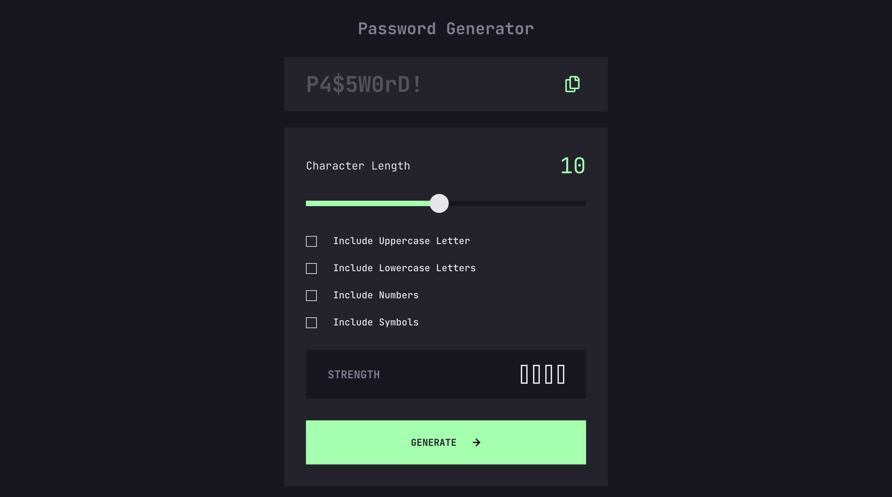

# Frontend Mentor - Password generator app solution

This is a solution to the [Password generator app challenge on Frontend Mentor](https://www.frontendmentor.io/challenges/password-generator-app-Mr8CLycqjh). Frontend Mentor challenges help you improve your coding skills by building realistic projects.

## Table of contents

- [Overview](#overview)
  - [The challenge](#the-challenge)
  - [Screenshot](#screenshot)
  - [Links](#links)
- [My process](#my-process)
  - [Built with](#built-with)
  - [What I learned](#what-i-learned)
  - [Useful resources](#useful-resources)
- [Author](#author)
- [Acknowledgments](#acknowledgments)

## Overview

### The challenge

Users should be able to:

[x] Generate a password based on the selected inclusion options
[x] Copy the generated password to the computer's clipboard
[x] See a strength rating for their generated password
[-] View the optimal layout for the interface depending on their device's screen size
[x] See hover and focus states for all interactive elements on the page

### Screenshot

### Links

- [Solution URL](https://password-generator-six-alpha.vercel.app/)
- [Live Site URL](https://github.com/robcrock/password-generator)

## My process

### Built with

- [Vite](https://vitejs.dev/)
- [Tailwind](https://tailwindcss.com/)
- [TypeScript](https://www.typescriptlang.org/)
- [React](https://reactjs.org/)

### What I learned

This challenge allow me to use a handy hook from the copy functionality from react.gg. I continued using shadcn. I also used the most helpful `group` class from Tailwind to style nested elements without setting state.

### Useful resources

- [Styling Parent to Child](https://tailwindcss.com/docs/hover-focus-and-other-states#styling-based-on-parent-state) - Great way to style an icon when hovering over the button.
- [useCopyToClipboard Hook](https://usehooks.com/usecopytoclipboard) - This hook makes copy text to the clipboard super simple.
- [Place Content Center](https://tailwindcss.com/docs/place-content) - How to easily center content.

## Author

- Website - [Robert Crocker](https://www.robcrock.com)
- Frontend Mentor - [@robcrock](https://www.frontendmentor.io/profile/robcrock)
- Twitter - [@robcrock](https://twitter.com/robcrock)
